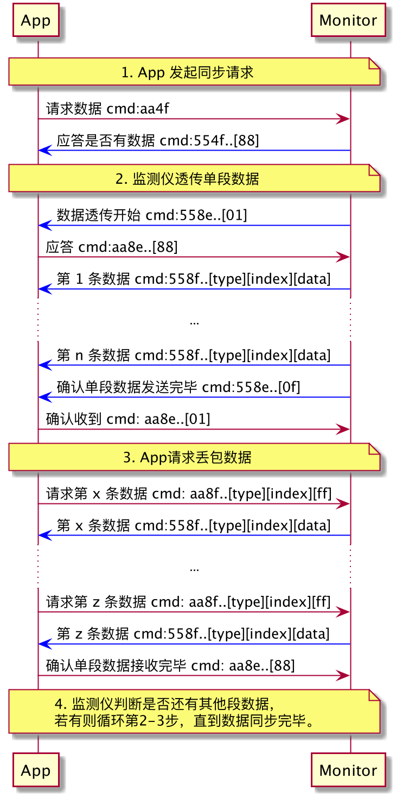

[TOC]
# App，监测仪，速眠仪关系
<br>
App、速眠仪各自都与监测仪相连接，App控制速眠仪是通过监测仪透传数据实现的。

# 蓝牙扫描过滤条件
速眠蓝牙设备的名字都是以"M-SUMIAN"开头的，可以通过该条件过滤其它设备。

# 蓝牙服务UUID
```
SERVICE_UUID = "6e400001-b5a3-f393-e0a9-e50e24dcca9e"
WRITE_UUID = "6e400002-b5a3-f393-e0a9-e50e24dcca9e"
NOTIFY_UUID = "6e400003-b5a3-f393-e0a9-e50e24dcca9e"
DESCRIPTORS_UUID = "00002902-0000-1000-8000-00805f9b34fb"
```

# 蓝牙指令
## 指令规范
### 指令格式
```
[aa][bb][cc][d..d]
```
字段|解释
---|---
a| 1 byte cmd head
b| 1 byte cmd
c| 1 byte data length
d| [cc] byte data content

### 响应码
字段|解释
---|---
88 | 成功
ff | 失败
fe | 指令不支持

## 基本指令
> 文档说明：A: App 发送指令， M：监测仪发送指令

### 设置时间
```
A: aa 40 08 [yyyyMMddHHmmssaa]
M: 55 40 01 [88]
```
字段|解释
---|---
yyyyMMddHHmmssaa|年与日时分秒 24小时制。aa为18 表示24小时制

### 查询监测仪电量
```
A: aa 44
M: 55 44 01 [aa] //（存在主动上报）
```
字段|解释
---|---
a| 电量,0-100

### 查询监测仪、速眠仪工作状态
```
A: aa 61
M: 55 61 02 [aabb]
A: aa 61 01 88 //（存在主动上报）
```
字段|解释
---|---
a| 监测仪监测模式：00 未开启，01 开启； 
b| 速眠仪pa模式：00 未开启，01 开启

### 查询速眠仪连接状态
```
A: aa 4e
M: 55 4e 01 [aa]
```
字段|解释
---|---
a| 00 未连接，01 连接

### 查询速眠仪电量
```
A: aa 45
M: 55 45 01 [aa] //（存在主动上报）
```
字段|解释
---|---
a| 电量,0-100

### 查询监测仪SN
```
A: aa 53
M: 55 53 0e [a..a]
```
字段|解释
---|---
a| sn号（String格式）对应的byte[]

### 查询速眠仪SN
```
A: aa 55
M: 55 55 0e [a..a]
```
字段|解释
---|---
a| sn号

### 查询速眠仪MAC
```
A: aa 56
M: 55 56 06 [a..a]
```
字段|解释
---|---
a| mac(数字形式)


### 查询监测仪版本信息
```
A: aa 50
M: 55 50 07 [aaaaaa bb cccccc dddddd eeeeee]
```
字段|解释
---|---
a| 软件版本, 每byte（无符号byte）代表版本号一段，格式形如 10.01.01
b| 渠道：临床0C， 正式0E
c| 硬件版本
d| 心率库版本
e| 睡眠算法版本号

### 查询速眠仪版本信息
```
A: aa 54
M: 55 54 06 [aaaaaa bbbbbb cccccc]
```
字段|解释
---|---
a| 速眠仪软件版本号
b| 速眠仪硬件版本号
c| 速眠仪头部检测算法版本号
        

### 设置用户信息
```
A: aa 4b 04 [aa bb cc dd]
M: 55 4b 01 88
```
字段|解释
---|---
a| 性别，男 00，女 01， 默认 ff
b| 年龄，默认ff
c| （身高体重比 bmi）* 5， 默认 ff
d| 失眠程度，默认ff

### 监测仪进入 dfu 模式
进入dfu模式后mac地址+1，通过信息的mac地址进行dfu升级
```
A: aa 51
M: 55 51 01 [aa]
```
字段|解释
---|---
a| 88 success, e1 监测仪电量过低, e2 正在上传睡眠数据, e3 正在透传速眠仪 LOG 数据

### 速眠仪进入 dfu 模式
进入dfu模式后mac地址+1，通过信息的mac地址进行dfu升级
```
A: aa 59
M: 55 59 01 [aa]
```
字段|解释
---|---
a| 88 success
### 更换绑定速眠仪
```
A:aa 52 0c [a..a]
M:55 52 01 [bb]
```
字段|解释
---|---
a| sn
b| 88 success, ff fail

### 查询速眠仪 pattern
```
A: aa 4c
M: 55 4c ee [03]   // ee 表示该条数据交代pattern总数，  03 表示有3中pattern，后续会陆续发送过来
M: 55 4c 05 10018f2050
M: 55 4c 05 2002bf2050
M: 55 4c 05 3003bf20a0
```


### 设置速眠仪 pattern
```
A: aa 4a 05 [aaaa bbbbbb]
M: 55 4a 03 [aaaa] [cc]
```
字段|解释
---|---
a| pattern 编号
b| pattern 内容
c| 88 success, ff fail

## 数据透传指令

### 时序图


### 查询是否有数据
```
A: aa 4f 01 [aa]
M: 55 4f 02 [aa][bb]
```
字段|解释
---|---
a| 数据类型： 01 睡眠特征数据, 02 速眠仪日志
b| 88 设备有睡眠特征数据,准备同步, 00 设备没有睡眠特征数据, ff 设备指令识别异常

### 透传数据开始/结束
```
M: 55 8e [a bbb cc dddddddd eeeeeeee ff gg hhhh]
```
字段|解释
---|---
a| 数据类型： 1 睡眠特征数据，2 速眠仪日志
b| 当前段数据条数
c| 当前段开始/结束：01 开始， 0f 结束
d| 透传开始时间
e| 睡眠记录起始时间
f| 此次透传总段数
g| 此次透传当前段数 从1开始
h| 此次透传总条数（各段透传条数之和）

### 透传单条数据
```
M: 55 8f [a bbb cccccccccccccccccc]
```
字段|解释
---|---
a| 数据类型： 1 睡眠特征数据，2 速眠仪日志
b| 该条数据index
c| 数据内容

### 请求丢帧数据
```
A: aa 8f 03 [a] [bbb] ff
M: 55 8f [a] [bbb] [cccccccccccccccccc]
```
字段|解释
---|---
a| 数据类型： 1 睡眠特征数据，2 速眠仪日志
b| 该条数据index
c| 数据内容
        
### 数据透传示例
```
// 查询是否有数据
aa 4f 0101
55 4f 0201 88

// 开始透传 package 1 /3
55 8e 112d 01 5cda6aa8 5cad48ac 03 01 038d
aa 8e 112d 01 5cda6aa8 88

55 8f 1000080000010002030405
55 8f 1001080100020003040506
.. .
55 8f 11290829012a012b2c2d2e
55 8f 112a082a012b012c2d2e2f
55 8f 112b082b012c012d2e2f30
55 8f 112c06100120023003

55 8e 112d 0f 5cda6aa8
aa 8e 112d 0f 5cda6aa8 01

// App 请求丢帧数据
aa 8f 03100aff
55 8f 100a080a000b000c0d0e0f
aa 8f 03101eff
55 8f 101e081e001f0020212223
aa 8f 031028ff
55 8f 102808280029002a2b2c2d
// App 告知所有数据已收到
aa 8e 112d0f5cda6aa8 88

// package 2/ 3
...
```